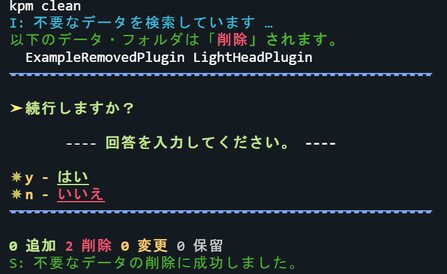
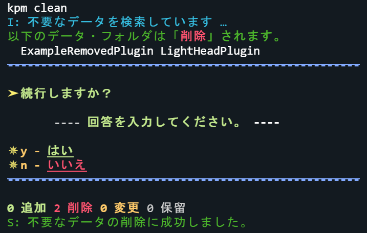
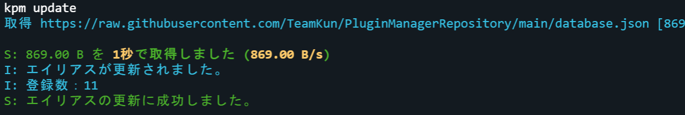
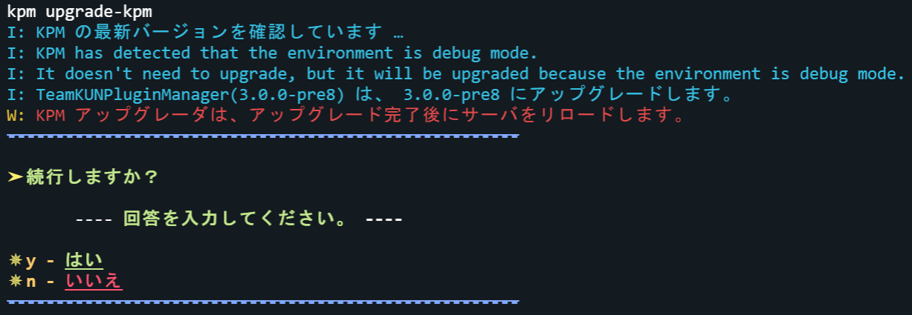
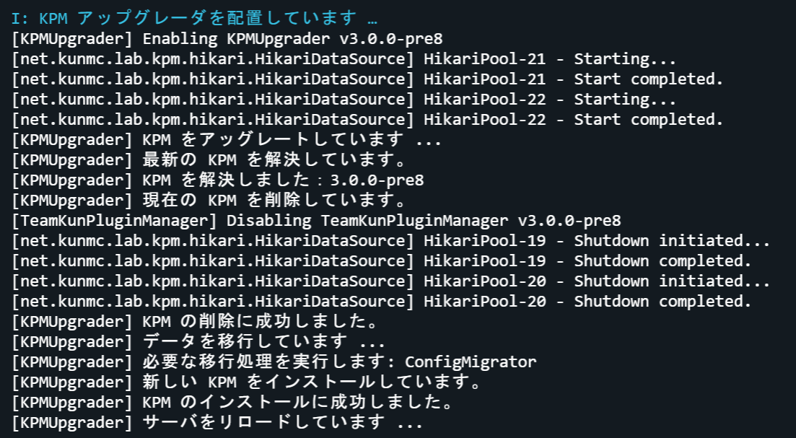
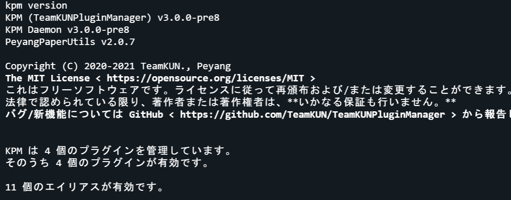

import Deprecation from "@site/src/components/Deprecation"
import BelowDocument from "@site/src/components/BelowDocument"
import Since from "@site/src/components/Since"

# コマンド

KPM のコマンドの一覧と実行要件を説明しています。

---

## コマンドの書き表し方

このドキュメントでは、コマンドを特定の記法に従って書き表します。このセクションではこの記法について軽く説明しています。

:::info

TeamKUNPluginManager を含む多くのプラグインでは、ほぼ同じ記法でドキュメントが書かれています。

:::

### 一般的な構文記述

このドキュメントでは、コマンドを以下のように記述しています：

```
/command <required argument> [optional argument]
```
カッコで囲われた部分は引数と呼ばれる、コマンドに与える値のことです。一般に、コマンド名の後に空白を入れて実行します。

`<required argument>` のような、 `<` と `>` で囲われた引数は必須の引数を表します。  
また、`[optional argument]` のような、 `[` と `]` で囲われた引数はオプションの引数を表します。

### 可変長引数における構文記述

また、以下のような記述も見られるでしょう：

```
/command <required argument> [optional argument...]
```

`...` がある引数は、オプションの引数を複数指定できることを表します（可変長引数）。  
この場合、 `[optional argument...]` は、０個以上、無限個未満のオプションの引数を表します。


## コマンド一覧

### <kbd>/teamkunpluginmanager</kbd>

KPM のメインコマンドです。
KPM の\*\* **すべての** \*\* コマンドはこのコマンドのサブコマンドです。

第一引数を省略した場合[ヘルプ](#help)を表示します。

#### エイリアス

- [<kbd>/kpm</kbd>](#teamkunpluginmanager)

  :::tip

  このエイリアスが最も使用されています！

  :::

- [<kbd>/kunpluginmanager</kbd>](#teamkunpluginmanager)
- [<kbd>/kunmgmt</kbd>](#teamkunpluginmanager)
- [<kbd>/kunpm</kbd>](#teamkunpluginmanager)

#### コマンド構文

- `/teamkunpluginmanager [<サブコマンド> [引数...]]`

#### 権限

- `kpm.use`
- `kpm.*`

:::tip

これ以下のコマンドは、すべて [<kbd>/teamkunpluginmanager</kbd>](#teamkunpluginmanager-コマンド) のサブコマンドです。  
適宜、脳内補完してください。

例１：** <kbd>example</kbd> ** => <kbd>/teamkunpluginmanager example</kbd>  
例２：** <kbd>example</kbd> ** => <kbd>/kpm example</kbd>

:::

---

### <kbd>autoremove</kbd>

不要なプラグインを再帰的に自動でアンインストールします。

不要なプラグインになる条件は以下の通りです：

1. 必須 - KPM が依存関係として自動でインストールした。
2. 必須 - 依存されているプラグインが依存関係としてマークされている、または存在しない。
3. 任意 - プラグインとその依存関係のプラグインも上記の条件を満たしている。

#### 不要なプラグインの例

例えば、あなたのサーバには、以下のプラグインがインストールされています。

- `PluginA` は依存関係としてマークされており、PluginB に依存しています。 
- `PluginB` は依存関係としてマークされており、 PluginD に依存しています。
- `PluginC` は依存関係としてマークされていませんが、PluginD に依存しています。
- `PluginD` は依存関係としてマークされています。

このとき、
  
- `PluginA` は依存関係としてマークされていますが、どのプラグインからも依存されていないため削除されます。
- `PluginB` は依存関係としてマークされており、 `PluginA` から依存されています。  
  ですが、唯一依存されている `PluginA` も削除されるため、 `PluginB` も削除されます。
- `PluginC` は依存関係としてマークされていないため、削除されません。
- `PluginD` は依存関係としてマークされていますが、 依存関係ではない `PluginC` から依存されているため、削除されません。  
  また、 依存関係としてマークされている `PluginB` からも依存されていますが、上記により `PluginB` の方のみが削除されます。
  
以上より、このサーバでは `PluginA` と `PluginB` が削除されます。



#### エイリアス

_\(なし)_

#### コマンド構文

- `autoremove`\(引数なし)

#### 権限

- `kpm.autoremove`
- `kpm.*`

#### スクリーンショット

  


---

### <kbd>clean</kbd>

削除された、サーバに存在しないプラグインのデータ・フォルダとその中身を削除します。

:::tip

削除から除外するには、 KPM 設定ファイルの [`execlude.pluginNames`](/docs/use-kpm/getting-started/configuration#excludepluginnames) に名前を追加します。

:::

#### エイリアス

_\(なし)_

#### コマンド構文

- `clean`\(引数なし)

#### 権限

- `kpm.clean`
- `kpm.*`

#### スクリーンショット

  


---

### ~~<kbd>debug</kbd>~~

KPM のデバッグ用コマンドです。

<Deprecation message={"このコマンドはデバッグ用であり、頻繁に変更される可能性があります。"} />


#### エイリアス

_\(なし)_

#### コマンド構文

- `debug ...`

#### 権限

- `kpm.debug`
- `kpm.*`

---

### <kbd>info</kbd>

プラグインの詳細な情報を表示します。

<BelowDocument docId="use-kpm/commands/info" />

---

### <kbd>install</kbd>

プラグインを新規[インストール](/docs/expressions/#インストール)します。

<BelowDocument docId="use-kpm/commands/install" />

---

### <kbd>register</kbd>

KPM と GitHub の連携を行います。

<BelowDocument docId="use-kpm/commands/register" />

---

### <kbd>status</kbd>

:::tip

このコマンドは <kbd>[version](#version)</kbd> コマンドに移行されました。  
そのため、このコマンドを実行すると <kbd>[version](#version)</kbd> コマンドが実行されます。

:::

---

### <kbd>uninstall</kbd>

プラグインをサーバから削除\([アンインストール](/docs/expressions/#アンインストール))します。

<BelowDocument docId="use-kpm/commands/uninstall" />

---

### <kbd>update</kbd>

KPM のエイリアス定義ファイルを更新します。

#### エイリアス

_\(なし)_

#### コマンド構文

- `update`\(引数なし)

#### 権限

- `kpm.update`
- `kpm.*`

#### スクリーンショット



---

### <kbd>upgrade</kbd>

サーバのプラグインを最新のバージョンにアップグレードします。

<Since version="v3" newMode />

<BelowDocument docId="use-kpm/commands/upgrade" />

---

### <kbd>upgrade-kpm</kbd>

KPM を最新のバージョンにアップグレードします。

<Since version="v3" newMode />

:::warning

このコマンドは、アップグレード完了時に内部でサーバをリロードします。  
リロード後、サーバのプラグインが正常に動作しない場合がありますが、適宜再起動してください。

:::

#### エイリアス

_\(なし)_

#### コマンド構文

- `upgrade-kpm`\(引数なし)

#### 権限

- `kpm.upgrade-kpm`
- `kpm.*`

#### スクリーンショット

  


---

### <kbd>version</kbd>

KPM のバージョンやライセンス、ステータスを表示します。

<Since version="v3" newMode />

#### エイリアス

- `v`
- `status`

#### コマンド構文

- `version`\(引数なし)

#### 権限

- `kpm.version`
- `kpm.*`

#### スクリーンショット


