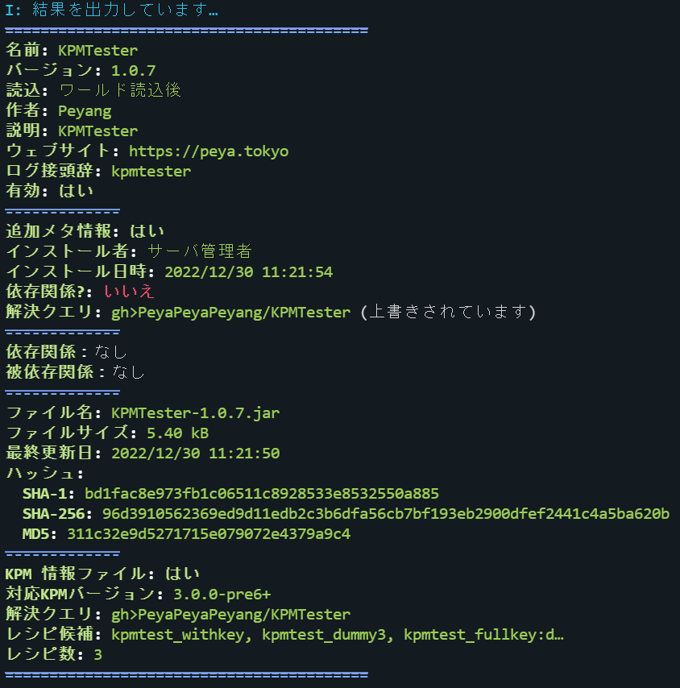
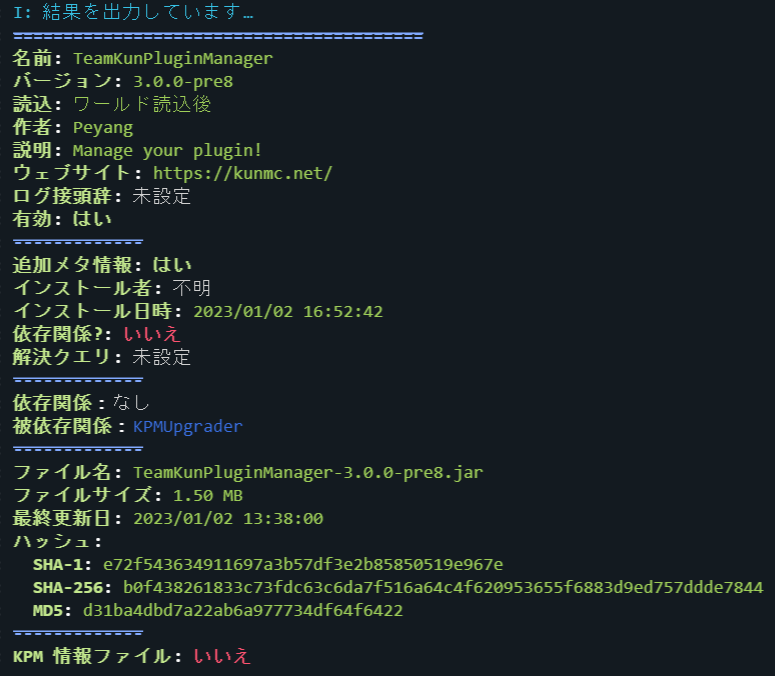

# プラグイン情報コマンド

プラグインの詳細な情報を表示します。

---

## コマンド概要 - <kbd>/kpm info</kbd> {#overview}

プラグインの詳細な情報を表示します。  
このコマンドの実行結果には、以下が含まれます：

+ プラグインが提供する固有の基本情報
+ KPM が提供する、インストール日時やインストール者などの追加情報
+ 依存関係と被依存関係の一覧
+ プラグインのファイルと更新日時、ハッシュ等の追加情報
+ KPM 情報ファイルによって提供される固有の追加情報（あれば）

### エイリアス {#aliases}

_\(なし)_

### コマンド構文 {#syntax}

- `info <プラグイン名>`

### 権限 {#permission}

- `kpm.info`
- `kpm.*`

### スクリーンショット {#screenshots}

