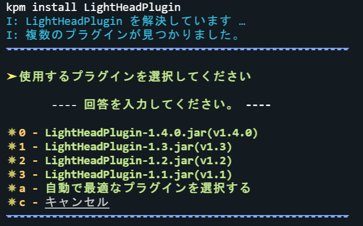
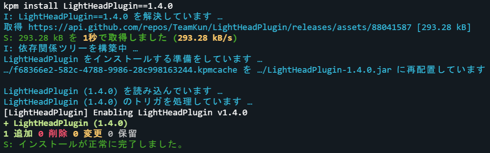

# インストールコマンド

プラグインを新規インストールします。

---

## コマンド概要 - <kbd>/kpm install</kbd>

プラグインを新規[インストール](/docs/expressions#インストール)します。

第一引数に有効な[クエリ](/docs/expressions/query)を指定する必要があります。

### エイリアス

- <kbd>i</kbd>

### コマンド構文

- `install <クエリ>`

第一引数には、対象のプラグインの有効な[クエリ](/docs/expressions/query)を指定します。

### 権限

- `kpm.install`
- `kpm.*`

### スクリーンショット

