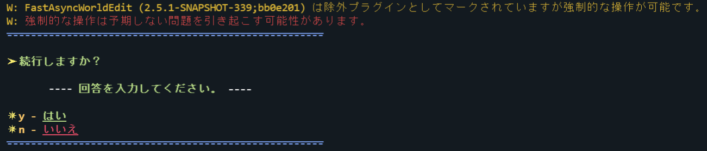
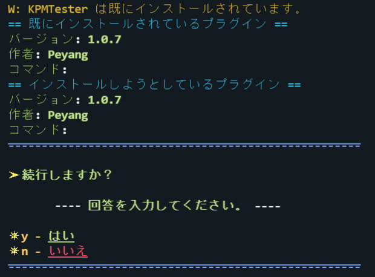

# インストールコマンド

プラグインを新規インストールします。

---

## コマンド概要 - <kbd>/kpm install</kbd>

プラグインを新規[インストール](/docs/expressions#インストール)します。

コマンドの実行結果と入力の説明は[こちら](#インストールの流れ)を参照してください。

### エイリアス

- <kbd>i</kbd>

### コマンド構文

- `install <クエリ>`

第一引数には、対象のプラグインの有効な[クエリ](/docs/use-kpm/features/query)を指定します。

### 権限

- `kpm.install`
- `kpm.*`

### スクリーンショット

## インストールの流れ

### [タスク](/docs/use-kpm/features/installer#インストールタスク)１. クエリを解決する

インストール対象のプラグインの .jar ファイルをダウンロードするために、クエリを解決し直リンクを入手します。  

また、プラグインの候補が複数ある場合、インストーラはそれらを全て表示して選択を促します。

#### 選択肢

選択は、チャットまたはコンソールに選択肢をそのまま入力します。

:::caution

`/` や `＊` などの接頭辞は入力する必要ありません。

:::

- <code><kbd>0</kbd>. - ...</code> や、 <code><kbd>1</kbd>. - ...</code> など、候補のインデックスがある選択肢 
  これは、通常のプラグインの候補です。基本的に、プラグインに複数のリリースまたはバージョンがある場合に表示されます。
- <code><kbd>a</kbd> - 自動で最適なプラグインを選択する</code> 
  これは、インストーラが自動で最適なプラグインを選択する選択肢です。  
  これを選択すると、基本的に最新のバージョンのプラグインが選択されます。
  また、GitHub のリリースを解決する場合、以下に示す方法で評価値を算出し、最も高い評価値を持つプラグインを選択します。

  :::tip
  
  KPM は、プレリリースバージョンよりも正式なバージョンを優先してインストールしようとします。
  
  :::

  

    
評価値の算出方法

  + 初期値は 0
  + メジャーバージョンに 1000 を掛けた値を足す
  + マイナーバージョンに 100 を掛けた値を足す
  + パッチバージョンに 10 を掛けた値を足す
  + プレリリースバージョンがある場合、 それに 1 を掛けた値を引く (全ての文字を Unicode の値に変換して足す)
  + ファイル名が `.jar` もしくは `.zip` で終わる場合、 500 を足す
  + ファイル名が `.api.jar` もしくは `.api.zip` で終わる場合、 500 を引く
  + リリースがプレリリースとしてマークおり、かつプレリリースバージョンがない場合、 500 を引く
    
  ---
    
    例1
    + バージョン `1.2.3`
    + ファイル名 `MyPlugin-1.2.3.jar`
    + プレリリース？： いいえ  
    
    評価値 = `0 + (1 * 1000) + (2 * 100) + (3 * 10) + 500 = 1230`
  
  例2
    + バージョン `1.2.3-pre1`
    + ファイル名 `MyPlugin-1.2.3-pre1.plugin.jar`
    + プレリリース？： はい  
      プレリリース (pre-1) = `114 + 45 + 49 = 472`
    
    評価値 = `0 + (1 * 1000) + (2 * 100) + (3 * 10) - 472 + 500 = 758`
    
  ---
    
    この場合、例1のプラグインが選択されます。
    
  

- <code><kbd>c</kbd> - キャンセル</code> 
  インストールをキャンセルします。

### タスク２. プラグインをダウンロードする

選択されたプラグインの .jar ファイルをダウンロードします。  
これに関して、特に選択肢はありません。

### タスク３. 環境をチェックする

KPM はプラグインとサーバ、および KPM に互換性があるかどうかを確認します。

チェックされる項目は以下の通りです。

+ プラグインが[除外リスト](/docs/use-kpm/getting-started/configuration#除外設定)に含まれていないかどうか
  プラグインが除外リストに含まれている場合、かつ強制的にインストールできる場合は、以下の選択肢が表示されます。  
  
  - <kbd>y</kbd> - はい 
    警告を無視してプラグインをインストールします。

    :::caution
  
    この警告はシステムを保護するために表示されています。これを無視すると、予期しない問題を引き起こす可能性があります。
  
    :::
  - <kbd>n</kbd> - いいえ 
    インストールをキャンセルし、全てのキャッシュを破棄します。
+ プラグインが重複していないかどうか  
  PaperMC（Bukkit） のプラグインは重複を許可しません。そのため、重複したプラグインはどちらか一方が適用されます。
  重複したプラグインをインストールしようとした場合、それぞれのプラグインの基本情報と、インストールを続行するかどうかを選ぶプロンプトが表示されます。

  
  - <kbd>y</kbd> - はい 
      警告を無視してプラグインをインストールします。
  
  :::caution
  
  この警告はシステムを保護するために表示されています。これを無視すると、予期しない問題を引き起こす可能性があります。
  
  :::
  - <kbd>n</kbd> - いいえ 
      インストールをキャンセルし、全てのキャッシュを破棄します。

+ KPM 情報ファイルが正しいかどうか
  <!-- TODO: KPM 情報ファイルの説明にリンク -->
  KPM は、正しい KPM 情報ファイルのみを受け入れます。間違った構文や、不正な値が含まれている場合、KPM はそれを無視しようとします。  
  このような場合、 インストールを続行するかどうかを選ぶプロンプトが表示されます。

  
  - <kbd>y</kbd> - はい 
      警告を無視してプラグインをインストールします。
  
  :::caution
  
  この警告はシステムを保護するために表示されています。これを無視すると、予期しない問題を引き起こす可能性があります。
  
  :::
  - <kbd>n</kbd> - いいえ 
      インストールをキャンセルし、全てのキャッシュを破棄します。

  :::info

  プラグインが KPM 情報ファイルを持っていない場合、このチェックはスキップされます。
  <!-- TODO: KPM 情報ファイルの説明にリンク -->

  :::

### タスク４. 依存関係を解決する

KPM は、上記の手順を依存関係に対しても行います。これは再帰的な操作です。

### タスク５. プラグインをダウンロードする

プラグインとその依存関係のビルドの成果物をキャシュにダウンロードします。  

:::tip

ダウンロードされたファイルは、ランダムな文字列 + .jar という名前で保存されます。

:::

### タスク６. プラグインをインストールする

KPM は、以下の手順に従って一つのプラグインをインストールします。

1. プラグインを `plugins/` ディレクトリに再配置する
2. プラグインのクラス・ローダーを作成し、 JAR ファイルを読み込む
3. プラグインの `onLoad()` メソッドを呼び出す
4. プラグインの `onEnable()` メソッドを呼び出す
5. プラグインのトリガを処理する

この手順は、依存関係のプラグインから順に実行され、最後に対象のプラグインがインストールされます。
また、依存関係読み込み順は、依存ツリーが深いプラグインを優先して読み込みます。
