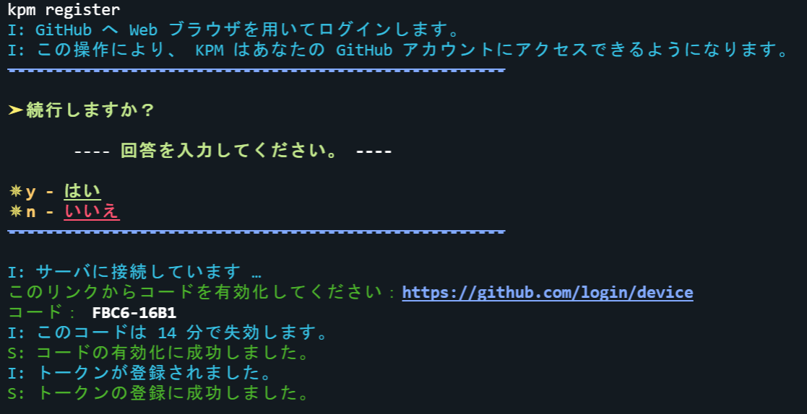
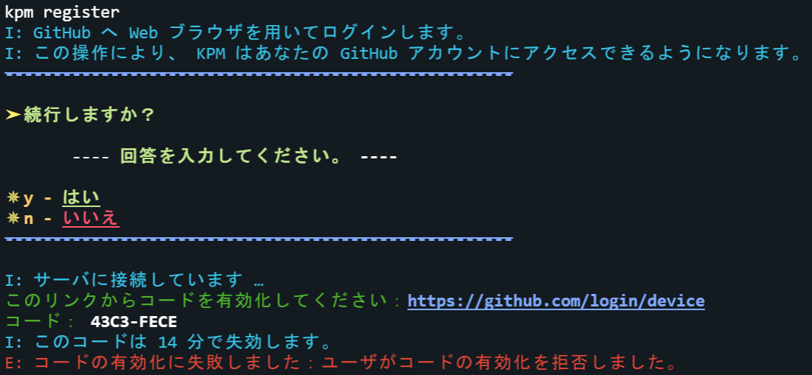
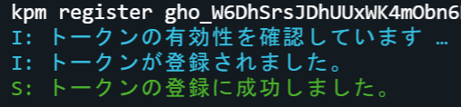

import BelowDocument from "/src/components/BelowDocument"

# GitHub 連携コマンド

KPM と GitHub を連携します。

---

## コマンド概要 - <kbd>/kpm register</kbd>

KPM と GitHub を連携します。

:::note

`register` は、もともと [GitHub の OAuth トークン](/docs/expressions#github-oauth-トークン)を登録するだけのコマンドだったために、
この名前になっています。  
しかし、現在は、トークンを生成する機能も含まれているためコマンド名の変更が検討されています。

:::

<BelowDocument docId="use-kpm/getting-started/link-github" />

### エイリアス

_なし_

### コマンド構文

- `register \[GitHub OAuth トークン]`

第一引数には [GitHub OAuth トークン](/docs/expressions#github-oauth-トークン)を指定できます。

:::info

引数なしで実行した場合、 [GitHub OAuth トークン](/docs/expressions#github-oauth-トークン) を自動で生成します。  
その場合、表示された指示に従ってください。

:::

### 権限

- `kpm.register`
- `kpm.*`

### スクリーンショット

