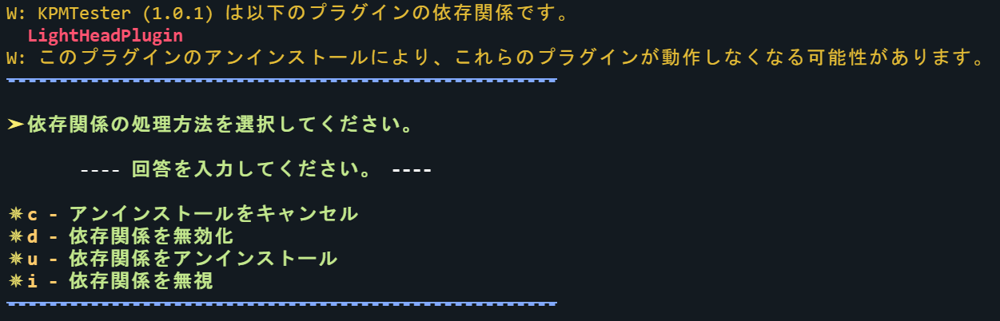
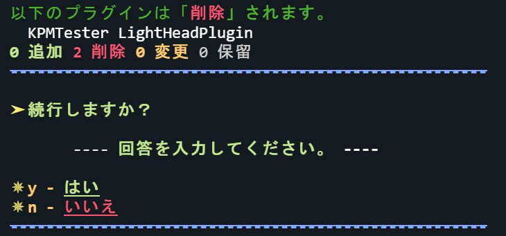

# アンインストールコマンド

プラグインをサーバから削除します。

---

## コマンド概要 - <kbd>/kpm uninstall</kbd>

プラグインをサーバから削除\([アンインストール](/docs/expressions#アンインストール))します。

:::tip
この操作では、プラグインのデータフォルダ（例：`plugins/TeamKUNPluginManager`）は削除されません。  
これらを削除する場合、このコマンドの実行後に [<kbd>clean</kbd>](./#clean) コマンドを実行してください。

:::

### エイリアス

- <kbd>remove</kbd>
- <kbd>rm</kbd>

### コマンド構文

- `uninstall <プラグイン名> [プラグイン名2...]`

### 権限

- `kpm.uninstall`
- `kpm.*`

## アンインストールの流れ

アンインストールコマンドを発行した後の KPM の動作と、ユーザが必要な操作を包括的に説明しています。

### 動作１. プラグインを検索する

アンインストール対象のプラグインを列挙します。

### 動作２. 環境をチェックする

KPM はプラグインを削除しても問題がないかを確認します。

チェックされる項目は以下の通りです：

+ プラグインが[除外リスト](/docs/use-kpm/getting-started/configuration#除外設定)に含まれているかどうか
プラグインが除外リストに含まれている場合、かつ強制的にインストールできる場合は、以下の選択肢が表示されます。  

- <kbd>y</kbd> - はい 
    警告を無視してプラグインをインストールします。

:::warning

この警告はシステムを保護するために表示されています。これを無視すると、予期しない問題を引き起こす可能性があります。

:::
- <kbd>n</kbd> - いいえ 
      インストールをキャンセルし、全てのキャッシュを破棄します。

+ 他のプラグインに依存されているかどうか
Bukkit と Java の仕様上、他のプラグインに依存されているプラグインを削除すると `NoClassDefFoundError` などのエラーが発生します。  
KPM はサーバ環境を保護するために、依存関係となっているプラグインアンインストールを推奨していません。
そのような依存関係がある場合は、処理方法を選択するプロンプトが表示されます。

- <code><kbd>d</kbd> - 依存関係を無効化</code> 
    依存されているプラグインを無効化（ disable ）します。

- <code><kbd>u</kbd> - 依存関係をアンインストール</code> 
    依存されているプラグインもアンインストールします。

- <code><kbd>i</kbd> - 依存関係を無視</code> 
    依存関係の処理を無視してアンインストールを続行します。

:::warning

この操作は予期しないエラーを引き起こす可能性があります。

:::

- <code><kbd>c</kbd> - キャンセル</code> 
    アンインストールをキャンセルし、全てのキャッシュを破棄します。

### 動作３. アンインストールの続行確認

本当にプラグインをアンインストールするかを確認するプロンプトが表示されます。  
プロンプトには、削除を選択した依存関係を含むすべてのアンインストール対象のプラグインが表示されます。

- <code><kbd>y</kbd> - はい</code> 
  アンインストールを続行します。

  :::warning
  この操作は永久的であり、元に戻すことはできません。
  :::

- <code><kbd>n</kbd> - いいえ</code> 
  アンインストールをキャンセルし、全てのキャッシュを破棄します。

### 動作４. プラグインの削除順を計算する

KPM は、依存関係を考慮したプラグインの削除の順番を計算します。この決定は、依存関係ツリーに基づき行われます。

### 動作５. プラグインを削除する

以下の処理を１単位として全てのプラグインに対して実行します。

1. レシピを全て削除する  
  削除されるレシピのカスタマイズについては[こちら](/dev-docs/api/kpm-info#プラグインのカスタムレシピ)を参照してください。
2. プラグイン・コマンドを全て削除する
3. プラグインの `onDisable()` メソッドを呼び出す
4. Bukkit をインジェクションし、プラグインのエントリを削除する
5. プラグインのクラスをアンロードする（プラグインのクラスローダーを破棄する）

この手順は、アンインストール対象のプラグイン一つずつに適用されます。 

また、全てのプラグインの削除後、以下の内容が実行されます。

1. サーバ JVM の [ガベージ・コレクション\(GC)](https://wa3.i-3-i.info/word1176.html) を実行する
2. プラグインの `.jar` ファイルを削除する  
  この操作は非同期で行われます。
3. プレイヤのコマンドを再読込する
