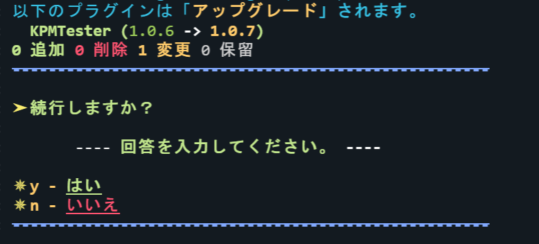
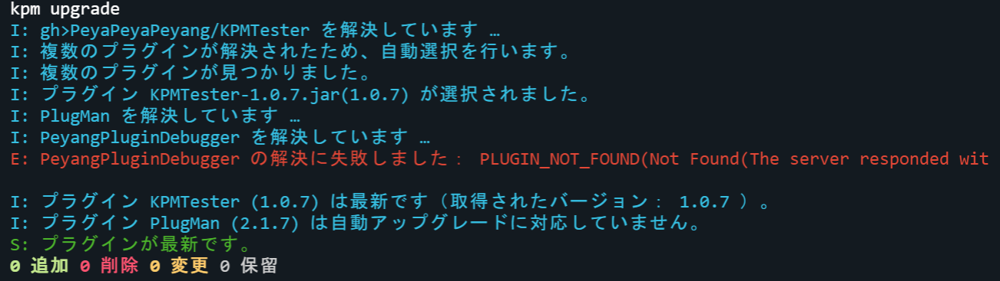

import Since from "../../../src/components/Since"

# アップグレードコマンド

サーバのプラグインを最新のバージョンにアップグレードします。

---

## コマンド概要 - <kbd>/kpm upgrade</kbd> {#overview}

サーバのプラグインを最新のバージョンにアップグレードします。
このコマンドは、内部で [アンインストール](/docs/expressions/#uninstall) と [インストール](/docs/expressions/#install) を実行します。

<Since version="v3" newMode />

:::warning

このコマンドでは、 KPM 自体をアップグレードできません。  
KPM をアップグレードする場合、 <kbd>[upgrade-kpm](/docs/use-kpm/commands#upgrade-kpm)</kbd> コマンドを使用してください。

:::

### エイリアス {#aliases}

_\(なし)_

### コマンド構文 {#syntax}

- `upgrade [プラグイン名１] [プラグイン名２]...`

引数を省略した場合、サーバの全てのプラグインをスキャンし、アップグレードします。

### 権限 {#permissions}

- `kpm.upgrade`
- `kpm.*`

### スクリーンショット {#screenshots}

