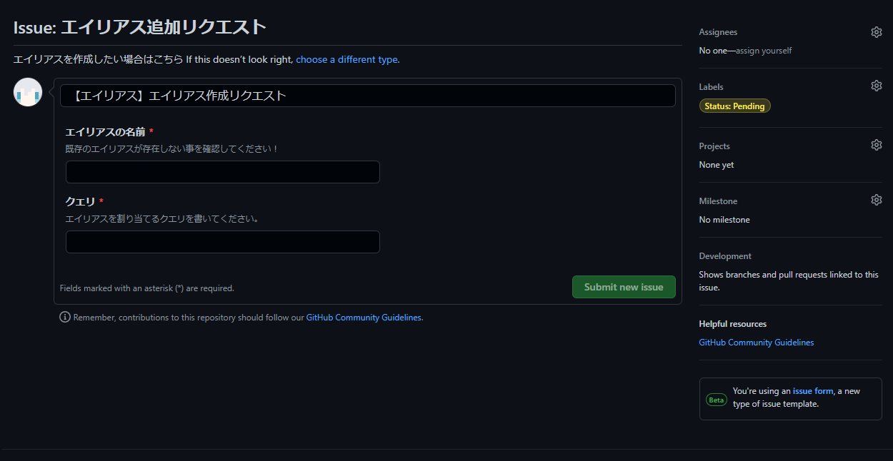

import Since from "@site/src/components/Since"

# エイリアスを作成する

[エイリアス](README)を作成する方法を説明しています。

---

<Since version={"v3"} />

## このページの前提要件

| 要件名                                      | 要件                                               | 摘要                                                                       |
| :------------------------------------------ | :------------------------------------------------- | :------------------------------------------------------------------------- |
| [GitHub](https://www.github.com) アカウント | 有効な [GitHub](https://www.github.com) アカウント | エイリアスの管理に [GitHub](https://www.github.com) アカウントが必要です。 |

---

## エイリアスマネージャを作成する

エイリアスの作成をしたことがない場合は、まずエイリアスマネージャを作成する必要があります。  
以下のステップを実行してください。

:::info
もしあなたが [KUNLab](https://github.com/TeamKUN) のメンバーであれば、このセクションを飛ばして [>**エイリアスを作成する**<](#エイリアスを作成する-1) に進んでください。
:::

### ステップ１. エイリアスマネージャ・リポジトリを作成する

[このテンプレート・リポジトリ](https://github.com/TeamKun/KPMAliasManager)を使用して、新しいリポジトリを作成します。

1. 画面右上の、`Use this template` をクリックします。  
   
2. リポジトリ名を入力し、 `Create repository from template` をクリックします。
   :::warning
   リポジトリの可視性は、 `Public` にしてください。
   Private にすると、 GitHub の仕様により、 YAML Issue Template 機能が無効化されます。これにより、エイリアスの作成が難しくなります。
   :::
   

### ステップ２. 設定を編集する

リポジトリを作成したら、初期設定を行います。

1. `src` フォルダに移動し、`global_constants.py` を開き、
   右上の <span style={{transform: "rotate(135deg)", display: "inline-block"}}>:pencil2:</span> ボタンをクリックします。
   

2. 以下の箇所を編集します。

- `ORG_NAME` を、あなたの GitHub アカウント名（もしくは組織名）に変更します。
- `REPO_NAME` を、作成したリポジトリ名に変更します。

```python title="global_constants.py"
  # ...

  GITHUB_TOKEN = os.getenv("GITHUB_TOKEN")
  # highlight-next-line
  ORG_NAME = "ExampleUser"
  # highlight-next-line
  REPO_NAME = "ExampleRepository"
  PERMISSION_LEVEL = "read"
  CHECK_USER_IN_ORG = True

  # ...
```

詳細な設定の一覧は、[こちら](#global_constantspy-について)を参照してください。

3. 右上の `Commit changes…` をクリックし、 表示されるダイアログの `Commit changes` をクリックします。

:::tip
ダイアログの内容を変更することもできますが、その場合は、`Commit directly to the main branch` にチェックを入れてください。
:::


### ステップ３. Issue label を作成する

1. リポジトリのトップページに移動し、 `Issues` をクリックします。  
   
2. `Labels` をクリックします。  
   
3. デフォルトのラベルを削除するために、 各ラベルの右側にある `Delete` をクリックし、表示されるダイアログの `OK` をクリックします。  
   
4. `New label` をクリックし以下のラベルを作成します。

| Label name                | Description                                        | Color     |
| :------------------------ | :------------------------------------------------- | :-------- |
| `Status: Triage approved` | エイリアスの作成が承認されたことを示すラベルです。 | `#0E8A16` |
| `Status: Triage denied`   | エイリアスの作成が拒否されたことを示すラベルです。 | `#B60205` |
| `Status: Pending`         | リクエストを確認中であることを示すラベルです。     | `#FCE94F` |

:::tip

ラベルの説明 (`Description`) と色 (`Color`) は、任意のものに変更することができます。

:::

作成したラベルは以下のようになります。  
 

### ステップ４. KPM に登録する

1. KPM の設定ファイル \(config.yml) を開き、以下の箇所を編集します。
   - `<エイリアスマネージャの任意の名前>` には、任意の文字列を指定します。
   - `<GitHubアカウント名>` には、エイリアスマネージャのリポジトリを作成した GitHub アカウント名を指定します。
   - `<リポジトリ名>` には、エイリアスマネージャのリポジトリ名を指定します。

```yaml title="config.yml"
# ...

# ----------------------[ プラグイン解決設定 ]-------------
# プラグインの解決の設定を定義します。
# プラグイン解決とは、 インストール時等に指定するクエリから、プラグインのJarの直リンクを取得する一連の流れを指します。
# ------------------------------------------------------
resolve:
  # ...

  # KPM のプラグイン解決に使用されるエイリアスの設定を定義します。
  aliases:
    # エイリアスの取得元（データソース）を定義します。
    sources:
      # ...
      # highlight-start
      - name: "<エイリアスマネージャの任意の名前>"
        url: "https://raw.githubusercontent.com/<GitHubアカウント名>/<リポジトリ名>/main/aliases.json"
    # highlight-end
  # ...
```

2. サーバを再起動またはリロードします。
   <kbd>/reload confirm</kbd> を実行するか、サーバを再起動してください。

---

## エイリアスを作成する

エイリアスの追加は、GitHub の Issue 機能を使用してリクエストします。以下の手順でリクエストを作成してください。

### リクエストを送信する

1. リポジトリのトップページに移動し、 `Issues` をクリックします。
   :::info
   もしあなたが [KUNLab](https://github.com/TeamKUN) のメンバーであれば、[`https://github.com/TeamKUN/PluginManagerRepository`](https://github.com/TeamKUN/PluginManagerRepository) で作業してください。
   :::
2. 画面右上の `New issue` をクリックします。  
   
3. 画面中央の `エイリアス追加リクエスト` セクション右側の `Get started` をクリックします。  
   
4. `エイリアスの名前` に作成したいエイリアス名を、 `クエリ` に、紐づけるクエリを入力します。  
   

:::tip
タイトルの `【エイリアス】エイリアス作成リクエスト` は編集しなくても問題ありません。
:::

:::warning
画面右側の `Label` は変更しないでください。
:::

5. 画面下部の `Submit new issue` をクリックします。  
   

### トリアージの結果

リクエストのトリアージが完了すると、ラベルが付与され、 github-actions からのコメントが追加されます。  
トリアージ完了時には、 Issue が閉じられ、会話が制限されます。

#### 承認された場合


#### エイリアスが作成された場合

承認後エイリアスが作成されると、以下のようなコメントが追加されます。


#### 拒否された場合


拒否事由によって以下のようにコメントが変わります。

| 拒否事由                                     | 拒否事由 (RAW)                      | コメント                                                   |
| :------------------------------------------- | :---------------------------------- | :--------------------------------------------------------- |
| 組織に所属してない                           | `UNAUTHORIZED::NOT_IN_ORGANIZATION` | あなたはこのリポジトリを所有する組織に所属していません。   |
| 適切な権限がない                             | `UNAUTHORIZED::NO_PERMISSION`       | あなたはこのリポジトリに対して十分な権限を持っていません。 |
| エイリアス名に使用できない文字が含まれている | `INVALID_ALIAS_NAME`                | エイリアス名が不正です。                                   |
| リクエストフォームに沿った書き方をしていない | `UNABLE_TO_PARSE_REQUEST`           | リクエストの解析に失敗しました。                           |
| エイリアス名が既に存在している               | `DUPLICATE`                         | 既に同じエイリアスが存在します。                           |

---

## 詳細情報

### global_constants.py について

`global_constants.py` は、エイリアスマネージャの設定ファイルです。設定の一覧は以下の通りです。

:::warning

`ISSUE_NUMBER` と `GITHUB_TOKEN` は実行時に自動的に設定されるため、編集しないでください。

:::

| 設定名                 | デフォルト値            | 摘要                                                                                                                  |
| :--------------------- | :---------------------- | :-------------------------------------------------------------------------------------------------------------------- |
| ISSUE_NUMBER           | ...                     | GitHub の Issue の番号です。                                                                                          |
| GITHUB_TOKEN           | ...                     | GitHub のトークンです。                                                                                               |
| ORG_NAME               |                         | GitHub の組織・ユーザ名です。                                                                                         |
| REPO_NAME              |                         | GitHub のリポジトリ名です。                                                                                           |
| PERMISSION_LEVEL       | read                    | エイリアスを追加する際の権限レベルです。この権限よりもリポジトリの権限が低いユーザは、エイリアスを追加できません。    |
| CHECK_USER_IN_ORG      | True                    | ユーザが組織に所属しているかどうかをチェックするかどうかです。この設定は、`ORG_NAME` が組織名である場合のみ有効です。 |
| APPROVED_LABEL_NAME    | Status: Triage approved | エイリアス追加のリクエストが承認された際に付与されるラベル名です。                                                    |
| DENIED_LABEL_NAME      | Status: Triage denied   | エイリアス追加のリクエストが拒否された際に付与されるラベル名です。                                                    |
| PENDING_LABEL_NAME     | Status: Triage pending  | エイリアス追加のリクエストが承認待ちの際に付与されるラベル名です。                                                    |
| ALIAS_PATH             | database.json           | エイリアスのデータベースへのパスです。                                                                                |
| ALIAS_NAME_PATTERN     | ^[a-zA-Z0-9_-]+$        | エイリアス名の正規表現です。                                                                                          |
| APPROVED_ISSUE_COMMENT | ...                     | エイリアス追加のリクエストが承認された際に、Issue に付与されるコメントです。                                          |
| DENIED_ISSUE_COMMENT   | ...                     | エイリアス追加のリクエストが拒否された際に、Issue に付与されるコメントです。                                          |
| DENY_REASONS           | ...                     | エイリアス追加のリクエストが拒否された際に、Issue に付与されるコメントの中で、拒否理由として表示される理由です。      |
| ALIAS_ADDED_COMMENT    | ...                     | エイリアスが追加された際に、Issue に付与されるコメントです。                                                          |

:::tip

`_COMMENT` で終わる設定は、`{alias_name}` がエイリアス名に補完されます。  
また、 `DENY_REASONS` は、`{reason}` が拒否理由に、 `{raw_reason}` がそのままの理由に補完されます。

:::
