import BelowDocument from "@site/src/components/BelowDocument";

# プラグインメタデータと依存関係ツリー

プラグインを管理するためにメタデータと依存関係ツリーを構築します。

---

## 概要 {#overview}

プラグインメタデータ（プラグインメタ）は、 KPM がプラグインを管理するために生成される追加データです。
これにはバージョン情報、作成者、依存情報などを含みます（[こちらのセクション](#meta-contents)で詳しく説明しています）。

KPM は、これらの情報にもとづいて、依存関係ツリーと呼ばれるプラグインを列挙する木構造のデータを構築します。
これは依存関係を柔軟に管理する、概念的なものです。プラグイン変更時に予め構築されたツリーを参照することで、次の操作時に高速に依存関係を参照できます。

これらの機能はそれぞれプラグインメタデータモジュールの機能であり、密接に関連しています。

## メタデータの保存場所 {#location}

プラグインメタデータは [SQLite3](https://www.sqlite.org/) データベースで管理され、初期状態では `plugins/plugins.db` に保存されます。  
保存場所を変更する方法については、[こちら](/docs/use-kpm/getting-started/configuration#paths-database-metadata)を参照してください。

## メタデータを覗く {#view-meta}

KPM が保存している全てのメタデータは、 [<kbd>/kpm info</kbd>](/docs/use-kpm/commands/info) コマンドで確認できます。  
このコマンドは、プラグインのメタデータをグラフィカルに整形して人間が読める形で表示します。

<BelowDocument docId="use-kpm/commands/info" />

## メタデータの構築タイミング {#build-timing}

メタデータ及び依存関係ツリーは KPM の介入の有無に関わらず、サーバのプラグインが変更されたときに構築されます。

変更が KPM による場合、プラグインの変更前に変更準備が行われます。これにより、完全な再構築をせずに安全にメタデータを構築できます。  
一方 KPM による変更でない場合、メタデータの構築は KPM が自動検知して行われます。
サーバが動いていないときに行われた変更は、次回の KPM の起動時に一括して行われます。

## メタデータに含まれる内容 {#meta-contents}

### プラグインの基本情報 {#basic-info}

このカテゴリには以下の情報が含まれます：

| 項目名       | 内部値                       | 摘要                              |
|:----------|:--------------------------|:--------------------------------|
| プラグイン名    | `plugin_meta.name`        | `plugin_meta` の主キーです。           |
| バージョン     | `plugin_meta.version`     |                                 |
| 読み込みタイミング | `plugin_meta.load_timing` | `plugin.yml` の `load` に対応しています。 |
| 作成者       | `plugin_author.author`    |                                 |

:::info

KPM はこれらの情報を直接的には使用しませんが、一応保存しています。意味はありません。

:::

### KPM による追加情報 {#kpm-extra-info}

このカテゴリには以下の情報が含まれます：

| 項目名      | 内部値                         | 摘要                                                                |
|:---------|:----------------------------|:------------------------------------------------------------------|
| インストール日時 | `plugin_meta.installed_at`  | プラグインがインストールされた日時です。                                              |
| インストール者  | `plugin_meta.installed_by`  | 値については[以下](#install-operator-values)を参照してください。                    |
| 依存関係かどうか | `plugin_meta.is_dependency` | 依存関係として KPM によって**自動で**インストールされたプラグインの場合は `true` です。              |
| 解決クエリ    | `plugin_meta.resolve_query` | プラグインがインストールされた際に使用されたクエリです。値が存在しない場合があります。 プラグインのアップデート等に使用されます。 |

#### プラグインのインストール者の値 {#install-operator-values}

+ `SERVER_ADMIN`： サーバの管理者によって**手動で**インストールされたプラグインです。
+ `KPM_DEPENDENCY_RESOLVER`： 依存関係として KPM によって**自動で**インストールされたプラグインです。
+ `KPM_PLUGIN_UPDATER`： KPM によってアップデートされたプラグインです。
+ `OTHER`： その他の方法でインストールされたプラグインです。
+ `UNKNOWN`： 未知の方法でインストールされたか、メタデータが破損しています。

実際の Enum 値は[こちらの Javadoc](javadoc:org.kunlab.kpm.enums.meta.InstallOperator) を参照してください。

### 依存関係などの情報 {#dependency-info}

依存関係などの情報は、以下の 3 つのテーブルに保存されます。

+ `depend`：プラグインの依存関係（Hard)が保存されています。
  `plugin.yml` の `depend` に対応しています。
+ `softdepend`：プラグインの依存関係（Soft)が保存されています。
  `plugin.yml` の `softdepend` に対応しています。
+ `loadbefore`：プラグインの依存関係（Load Before)が保存されています。
  `plugin.yml` の `loadbefore` に対応しています。

各依存関係が存在しない場合、それぞれのテーブルには何も保存されません。

### 依存関係ツリー {#dependency-tree}

これは[上のセクション](#dependency-info)の内容とにていますが、これは上記の各データをツリー構造に結合したものです。

依存関係は以下のようなイメージです。

:::info

実線、点線、破線はそれぞれ `depend`、`softdepend`、`loadbefore` に対応しています。

:::

