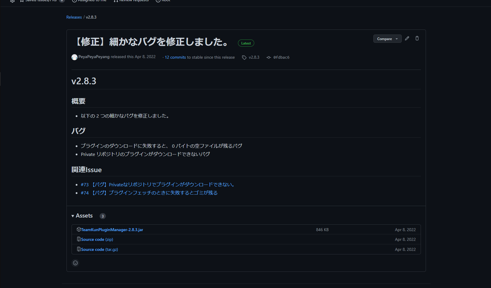

import BelowDocument from "@site/src/components/BelowDocument";

# KPM をインストールする

このページでは、KPM を新規にインストールします。

---

## このページの前提要件 {#requirements}

| 要件名                                                    | 要件                                               | 摘要                                                                                                                         |
| :-------------------------------------------------------- | :------------------------------------------------- | :--------------------------------------------------------------------------------------------------------------------------- |
| [Minecraft](https://www.minecraft.net) サーバソフトウェア | [PaperMC](https://papermc.io/) 1.13+               |                                                                                                                              |
| Java バージョン                                           | Java 1.8+                                          | PaperMC のバージョンに依存します。 [PaperMC ドキュメント](https://docs.papermc.io/paper/getting-started)を参照してください。 |
| [GitHub](https://www.github.com) アカウント               | 有効な [GitHub](https://www.github.com) アカウント | プラグインの解決に [GitHub](https://www.github.com) アカウントが必要です。                                                   |

:::caution

KPM は、 [PaperMC](https://www.papermc.io/) 以外のサーバ(例：Spigot, Bukkit…)では動作しません。
[PaperMC](https://www.papermc.io/) への移行ガイドは[こちら](https://docs.papermc.io/paper/migration)から参照してください。

:::

---

## KPM をサーバに追加する {#install-kpm}

プロサーバ管理者の朝は早い。曰く、 KPM をサーバにインストールしないと一日は始まらない。

### ステップ 1：最新のプラグイン・アーティファクト をダウンロードする {#download-latest-artifact}

1. [こちら](https://www.github.com/TeamKUN/TeamKUNPluginManager/releases/latest)にアクセスし、最新の[リリース](/docs/expressions#release)を確認します。
2. Assets の下の `TeamKunPluginManager-<バージョン>.jar` をクリックするとダウンロードが始まります。
3. 任意の場所に保存してください。

:::tip

:sparkles: このドキュメントの画像はクリックして拡大できます！ :sparkles:

:::

### ステップ 2：サーバのプラグインフォルダに配置する {#put-in-server-plugin-folder}

あなたが普段プラグインを追加するように、 KPM をサーバのプラグインフォルダ（例： `plugins/` ）に配置します。

### ステップ 3：サーバを再起動する {#restart-server}

サーバを再起動して KPM を有効化します。

:::caution

KPM は、PlugMan 等を使用した動的再読み込みには対応していません！  
これを行うと、予期しないバグまたはエラーが発生する可能性があります。  
(<kbd>/reload</kbd> 等のサーバのビルトイン・コマンドを使用した動的再読み込みは可能です。)

:::

---

## KPM と GitHub を連携する {#connect-kpm-github}

KPM を使用するには、 GitHub と連携する必要があります。

### ステップ 1：GitHub と連携する {#connect-github}

以下のチュートリアルに従い、 KPM と GitHub を連携してください。

<BelowDocument docId="use-kpm/getting-started/link-github" />

### ステップ ２：プラグイン定義ファイルをアップデートする {#update-plugin-definition-file}

[エイリアス](/docs/use-kpm/features/alias) の定義ファイルをアップデートします。
初期状態では、 [TeamKUN](https://github.com/TeamKUN) 公式で定義されたエイリアスが使用可能です。

エイリアスのアップデートには [<kbd>/kpm update</kbd>](/docs/use-kpm/commands/#update) コマンドを使用します。

---

## KPM を設定する {#configure-kpm}

KPM は初期状態でも問題なく使用できますが、いくつかの設定を行うことより便利に使用できます。

<BelowDocument docId="use-kpm/getting-started/configuration" />

---

## KPM を使う {#use-kpm}

KPM を使う準備が整いました！

KPM を使ってプラグインをインストールするには [こちら](/docs/use-kpm/commands/install) を、
プラグインをアンインストールするには [こちら](/docs/use-kpm/commands/uninstall) を参照してください。

KPM には他にも便利なコマンドがたくさんあります！

<BelowDocument docId="use-kpm/commands/README" />

### プラグインを開発していますか？ {#developer-notice}

もしあなたがプラグイン開発者であれば、 KPM API を使用して KPM と連携したプラグインを開発できます。  
例えば、必要な依存関係の取得元を定義したり、インストール時等々にあなたのプラグインの任意コードを実行できます。

詳しくは [こちら](/dev-docs/api) を参照してください。
