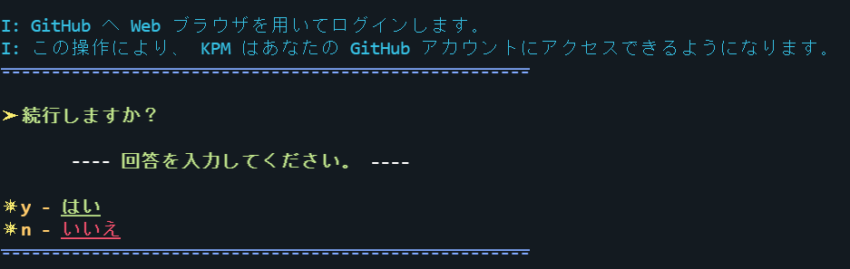
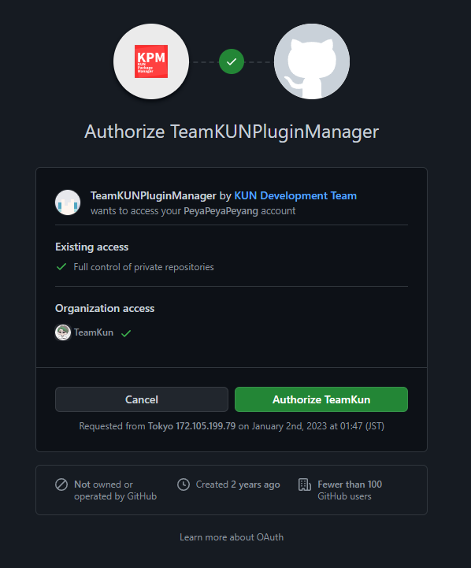

# KPM と GitHub を連携する

このページでは、KPM と GitHub を連携する方法を説明しています。

---

## このページの前提要件

| 要件名 | 要件 | 摘要 |
| :--- | :-- | :---- |
| TeamKUNPluginManager | 2.5+ | KPM をまだインストールしていない方は[こちら](Install)。 |
| [GitHub](https://www.github.com) アカウント | 有効な [GitHub](https://www.github.com) アカウント |  |

### ステップ 1：GitHub アカウントを作成する

[こちら](https://docs.github.com/ja/get-started/signing-up-for-github/signing-up-for-a-new-github-account)から GitHub アカウントを登録します。

    
上記の GitHub 公式ドキュメントを見ても GitHub アカウントの作り方がわからない方へ

[Google](https://www.google.com) で物事を検索する力をつけましょう！ 
基本的に [Google](https://www.google.co.jp) は安全で、あなたの味方です。  
あなたがサーバ管理初心者でも、またそうでなくても、[Google](https://www.google.it/) はあなたをあらゆる面でサポートします。  
まずは [Google](https://www.google.jp)で「GitHub 登録方法」で検索してみましょう。

:::tip

検索クエリを入力するのが面倒くさい怠惰な人用に\*\*[一瞬で検索できるリンク](https://letmegooglethat.com/?q=GitHub+%E7%99%BB%E9%8C%B2%E6%96%B9%E6%B3%95)\*\*を用意しました！
[Google](https://www.google.com.hk/?hl=ja) で検索をするためにあなたを導いてくれます。画面上の矢印と文字と [Google](https://www.google.com/search?q=%E3%82%B0%E3%83%BC%E3%82%B0%E3%83%AB) に従いましょう。

:::

### ステップ 2：KPM に GitHub OAuth トークンを登録する

:::tip

GitHub OAuth トークンをすでに持っている場合は、方法 2 を行ってください。
トークンを持っていない場合は、方法 1 でトークンを生成できます(この場合は方法 2 を行う必要はありません)。

:::

### 方法 1： KPM で GitHub OAuth トークンを生成する

1. KPM が起動したサーバで `/kpm register` を実行します。
2. 画面の指示に従って, <kbd>y</kbd> を入力します。  
  
3. 表示されたリンクまたは[こちら](https://www.github.com/login/device)から GitHub の認証ページにアクセスします。
4. 表示されたコードを認証ページに入力します。  
  
5. プラグインを使用するすべての組織のアクセスを許可します。  
  
6. `S: トークンを正常に保管しました！`を表示されたら完了です。

### 方法 2: 持っている GitHub OAuth トークンを KPM に登録する

1. KPM が起動したサーバで `/kpm register <トークン>` を実行します。
2. `S: トークンを正常に保管しました！`を表示されたら完了です。

## トラブルシューティング

### `E: エラーが発生しました。`と表示される。

GitHubのサーバに接続できませんでした。しばらくしてからもう一度お試しください。

### `E: エラーが発生しました。: Server response with ...`と表示される。

GitHubのサーバから不正な応答がありました。もう一度お試しください。

### `E: エラーが発生いたしました。：有効期限が切れています。`と表示される。

KPMが発行した一時トークンが失効しました。 もう一度手順を最初から行ってください。

### `E: エラーが発生いたしました。：キャンセルされました。`と表示される。

ユーザが認証をキャンセルしました。もう一度お試しください。

