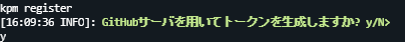
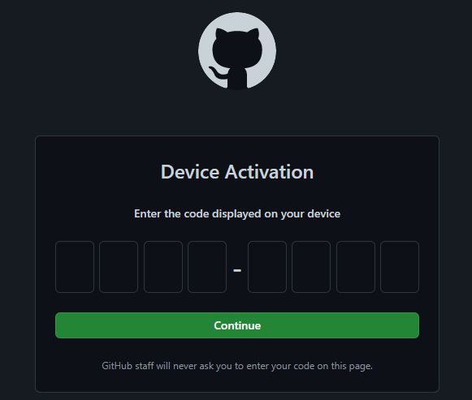
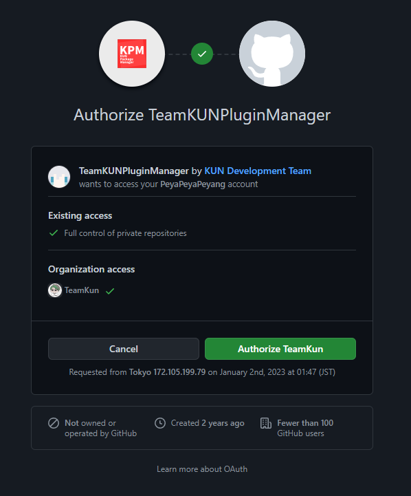

# KPM と GitHub を連携する

このページでは、KPM と GitHub を連携する方法を説明しています。

---

## このページの前提要件 {#requirements}

| 要件名                                      | 要件                                               | 摘要                                                                                      |
| :------------------------------------------ | :------------------------------------------------- | :---------------------------------------------------------------------------------------- |
| TeamKUNPluginManager                        | 2.5+                                               | KPM をまだインストールしていない方は[こちら](/docs/use-kpm/getting-started/install)。 |
| [GitHub](https://www.github.com) アカウント               | 有効な [GitHub](https://www.github.com) アカウント | プラグインの解決に [GitHub](https://www.github.com) アカウントが必要です。                                                   |

---

## GitHub と連携する {#connect-github}

### ステップ 1：GitHub アカウントを作成する {#create-github-account}

[こちら](https://docs.github.com/ja/get-started/signing-up-for-github/signing-up-for-a-new-github-account)から GitHub アカウントを登録します。

### ステップ 2：KPM に GitHub OAuth トークンを登録する {#register-github-oauth-token}

:::tip

GitHub OAuth トークンをすでに持っている場合は、[方式 2](#register-existing-github-oauth-token) を行ってください。  
トークンを持っていない場合は、方式 1 でトークンを生成できます(この場合は方式 2 を行う必要はありません)。

:::

#### 方式 1： KPM で GitHub OAuth トークンを生成する {#generate-with-kpm}

1. KPM が起動したサーバで [<kbd>/kpm register</kbd>](/docs/use-kpm/commands/register) を実行します。
2. 画面の指示に従って, <kbd>y</kbd> を入力します。

   

3. 表示されたリンクまたは[こちら](https://www.github.com/login/device)から GitHub の認証ページにアクセスします。
4. 表示されたコードを認証ページに入力します。  
   
5. プラグインを使用するすべての組織のアクセスを許可します。  
  

6. `S: トークンの登録に成功しました。` と表示されたら完了です。

#### 方式 2: すでにある GitHub OAuth トークンを KPM に登録する {#register-existing-github-oauth-token}

1. KPM が起動したサーバで `/kpm register <トークン>` を実行します。
2. `S: トークンの登録に成功しました。` と表示されたら完了です。

---

## トラブルシューティング {#troubleshooting}

#### `E: コードが失効しました： …` と表示される。 {#code-expired}

GitHub から発行されたコードの有効期限が切れました。もう一度試してください。

#### `E: コードの有効化に失敗しました：ユーザがコードの有効化を拒否しました` と表示される。 {#code-verify-failed}

GitHub でコードを有効化する時に、認証を拒否した可能性があります。もう一度試してください。

#### `E: トークンの生成中にI/Oエラーが発生しました。` と表示される。 {#io-error-occurred}

プラグイン内部で予期しないエラーが発生しました。サーバを再起動し、もう一度試してください。

#### `E: 検証コードの取得に失敗しました： …` と表示される。 {#code-fetch-failed}

GitHub のサーバから無効な応答を受け取りました。しばらく時間をおき、もう一度試してください。

#### `E: トークンが無効です。` と表示される。 {#invalid-token}

入力したトークンが無効です。もう一度確認するか、他のトークンを試してください。

#### `E: トークンの生成がキャンセルされました。` と表示される。 {#token-generation-cancelled}

トークンの生成時にキャンセルを選択したようです。もう一度試してください。
